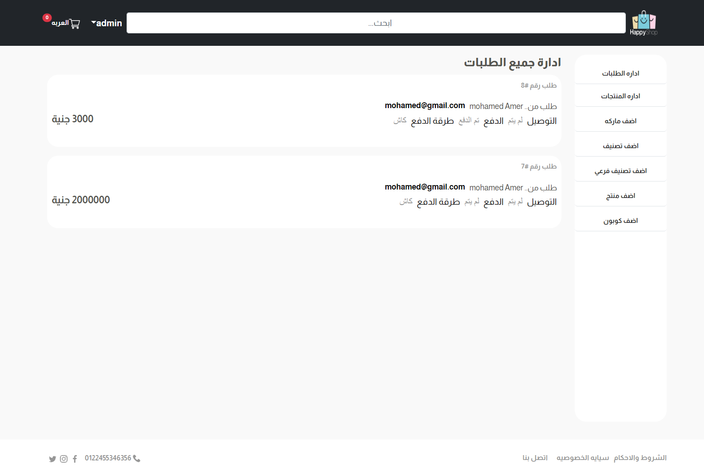

# E-commerce Project

## HomePage

## All Products Page

  
Click to view All Products Page

  

## All Products Page with Price filter

  
Click to view All Products Page with Price filter

  

## Specific Product Page

  
Click to view Specific Product Page

  

## All Categories Page

  
Click to view All Categories Page

  

## All Categories Page with filter

  
Click to view All Categories Page with filter

  

## All Brands Page

  
Click to view All Brands Page

  

## User Registration Page

  
Click to view User Registration Page

  

## User Login Page

  
Click to view User Login Page

  

## User Forgot Password Page

  
Click to view User Forgot Password Page

  

## User Profile Page

  
Click to view User Profile Page

  

## User Address Page

  
Click to view User Address Page

  

## User Edit Profile Page

  
Click to view User Edit Profile Page

  

## User Cart Page

  
Click to view User Cart Page

  

## User Choose Payment Method Page

  
Click to view User Choose Payment Method Page

  

## Admin Dashboard Page

  
Click to view Admin Dashboard Page

  

## Admin All Orders Page

  
Click to view Admin All Orders Page

  

## Admin All Products Page

  
Click to view Admin All Products Page

  

## Admin Add Category Page

  
Click to view Admin Add Category Page

  

## Admin Add SubCategory Page

  
Click to view Admin Add SubCategory Page

  

## Admin Add Product Page

  
Click to view Admin Add Product Page

  

## Admin Edit Product Page

  
Click to view Admin Edit Product Page

  

## Admin Delete Product Page

  
Click to view Admin Delete Product Page

  

## Admin Add Brand Page

  
Click to view Admin Add Brand Page

  

## Admin Add Coupon Page

  
Click to view Admin Add Coupon Page

  

